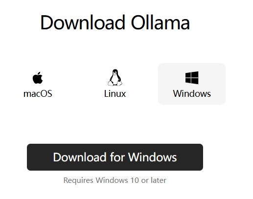
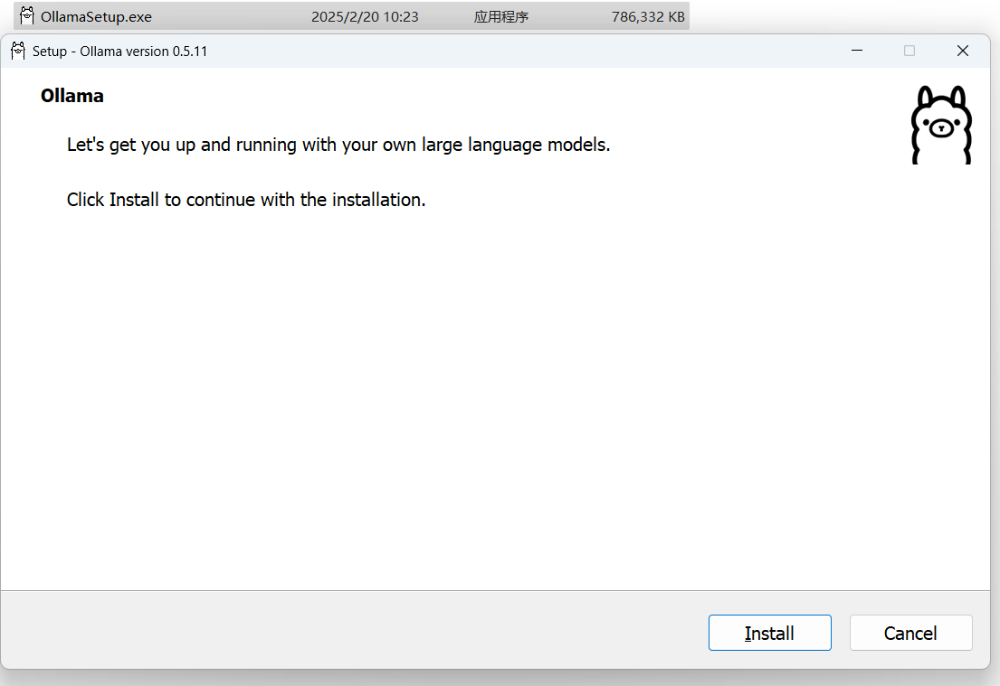
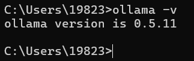
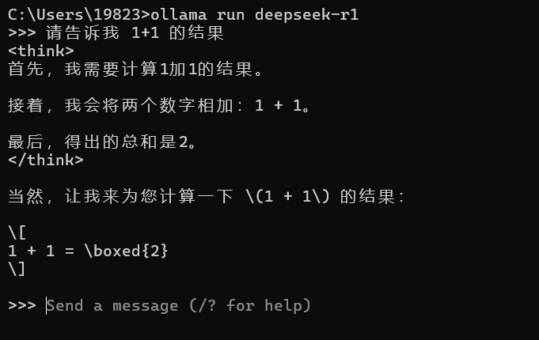

# 本地化部署 Deep Seek AI 模型
<!-- https://juejin.cn/post/7469001751493623844?searchId=20250220093928983FCAB55D2356920813#heading-17 -->

## Ollama

[Ollama](https://ollama.com/download) 是一个工具，允许您在个人计算机上本地运行开源 AI 模型。因为不仅是本项目可用 AI 模型，您的其他项目也可以使用 AI 大模型，因此，推荐使用全局 Ollama 方式安装：

<p align="center">
  
</p>

下载成功后，会有一个应用程序(.exe)，直接点击 install 即可：
<p align="center">
  
</p>

安装完成后，打开 `cmd` 命令行，输入以下命令：
```sh
ollama --version
```
<p align="center">
  
</p>

到此，Ollama 安装完成。

## 安装 DeepSeek 模型

```sh
## model 为具体的模型名称，例如: 1.5b | 7b | 14b ...
## 可不传，默认为 7b
ollama run deepseek-r1[:model]

## 下载时长与网络相关哈，请耐心等待
```
具体模型对比如下表：

| 模型大小 | Windows 配置                                                   | Mac 配置                                             | 服务器配置                                                  | 适用场景                  | 选择建议                                                                                   |
| -------- | -------------------------------------------------------------- | ---------------------------------------------------- | ----------------------------------------------------------- | ------------------------- | ------------------------------------------------------------------------------------------ |
| **1.5B** | - RAM: 4GB - GPU: 集成显卡（如 GTX1050）或现代 CPU - 存储: 5GB | - 内存: 8GB（统一内存） - 芯片: M1/M2/M3 - 存储: 5GB | -                                                           | 简单文本生成/基础代码补全 | 适合个人开发者或轻量级任务，低配置设备即可运行。                                           |
| **7B**   | - RAM: 8-10GB - GPU: GTX1660（4-bit 量化） - 存储: 8GB         | - 内存: 16GB - 芯片: M2Pro/M3 - 存储: 8GB            | -                                                           | 中等复杂度问答/代码调试   | 适合中等需求场景，如代码调试或简单问答，需中端显卡支持。                                   |
| **8B**   | - RAM: 12GB - GPU: RTX3060（8GB VRAM） - 存储: 10GB            | - 内存: 24GB - 芯片: M2Max - 存储: 10GB              | -                                                           | 多轮对话/文档分析         | 适合需要多轮交互或文档分析的场景，需较高显存和内存支持。                                   |
| **14B**  | - RAM: 24GB - GPU: RTX3090（24GB VRAM） - 存储: 20GB           | - 内存: 32GB - 芯片: M3Max - 存储: 20GB              | -                                                           | 复杂推理/技术文档生成     | 适合技术文档生成或复杂逻辑推理任务，需高端显卡和大内存。                                   |
| **32B**  | - RAM: 48GB - GPU: RTX4090（4-bit 量化） - 存储: 40GB          | - 内存: 64GB - 芯片: M3Ultra - 存储: 40GB            | -                                                           | 科研计算/大规模数据处理   | 适合科研或大规模数据处理，需顶级消费级显卡（如 RTX4090）。                                 |
| **70B**  | - RAM: 64GB - GPU: 双 RTX4090（NVLink） - 存储: 80GB           | - 内存: 128GB（需外接显卡） - 存储: 80GB             | - 服务器级多 GPU（如双 RTX4090） - RAM: 256GB+ - 存储: 80GB | 企业级 AI 服务/多模态处理 | 需企业级硬件支持，适合多模态处理或高并发 AI 服务，推荐服务器部署。                         |
| **671B** | - GPU: 8×H100（通过 NVLINK 连接） - 存储: 11B+                 | 暂不支持                                             | - GPU 集群（8×H100） - 存储: 11B+                           | 超大规模云端推理          | 仅限云端部署，需超大规模计算资源，适用于超大规模模型推理或训练场景，普通用户无法本地部署。 |

**注意：个人本地采用的模型为 7B，故而在实际代码开发阶段，也将采用 7B 模型思路**


## 运行 DeepSeek 大模型

```sh
ollama run deepseek-r1
```
<p align="center">
  
</p>


## 代码中使用 deepseek 模型

```ts
import ollama from "ollama";

const response = await ollama.chat({
  model: "<MODEL>",
  messages: [
    {
      role: "user",
      content: "List 5 foods from Italy. Explain their origins"
    }
  ]
});

console.log(response.message.content);

// OR

import { Ollama } from 'ollama'

const ollama = new Ollama({ host: 'http://127.0.0.1:11434' })
const response = await ollama.chat({
  model: 'deepseek-r1',
  messages: [{ role: 'user', content: 'Why is the sky blue?' }],
})
```